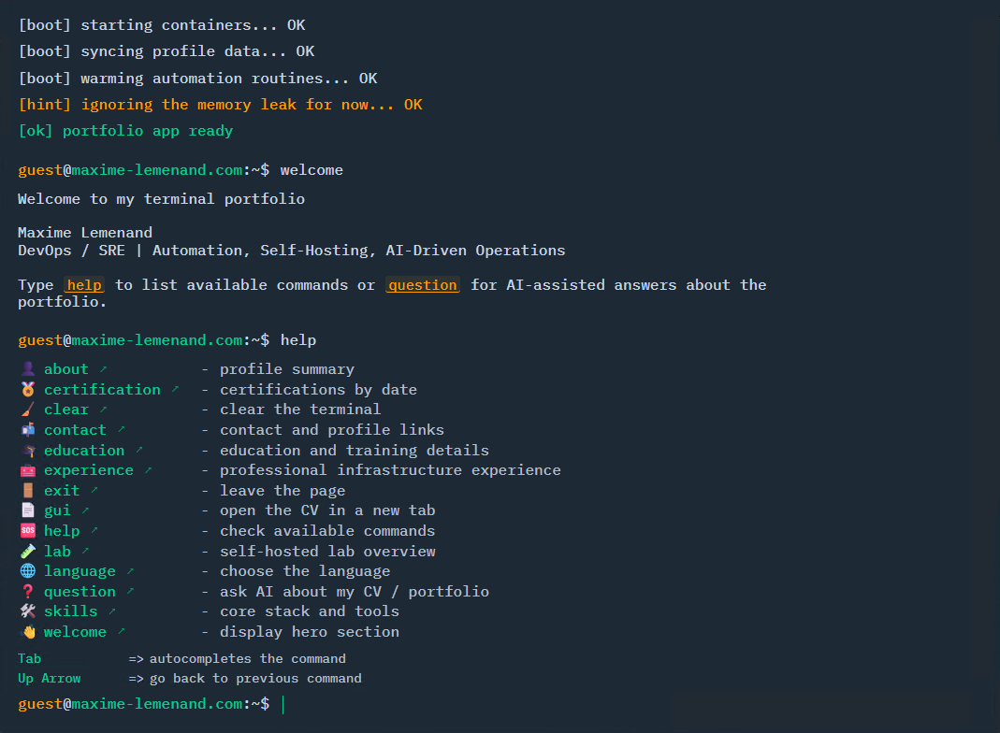
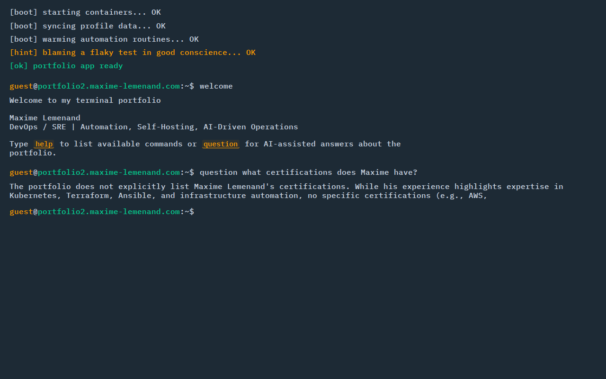
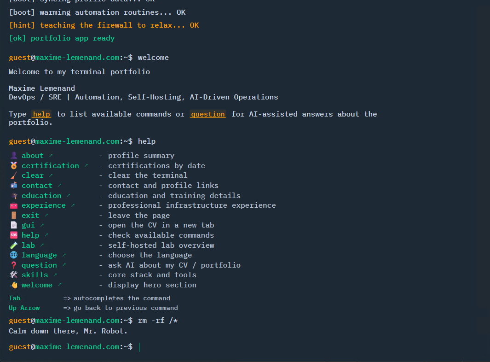

# 💻 Terminal Portfolio

> 🌐 [English](README.md) · [Français](README.fr.md) · **Español**

Un portfolio interactivo estilo terminal con preguntas y respuestas impulsadas por IA, soporte multilingüe y despliegue Docker-first.

## 📸 Capturas de pantalla

<table>
  <tr>
    <td align="center"><b>Secuencia de arranque</b></td>
    <td align="center"><b>Q&A con IA</b></td>
    <td align="center"><b>Comando desconocido</b></td>
  </tr>
  <tr>
    <td></td>
    <td></td>
    <td></td>
  </tr>
</table>

## ✨ Características

- 🤖 **Q&A con IA** — el comando `question` responde preguntas en lenguaje natural sobre el CV, proxificado a través de OpenRouter directamente desde nginx (sin servidor backend)
- 🌍 **Multilingüe** — interfaz completa FR / EN / ES con respuestas IA adaptadas a la configuración regional y un comando `language` para cambiar en tiempo de ejecución
- 🎬 **Secuencia de arranque animada** — líneas de inicio escritas carácter a carácter antes de que el terminal sea interactivo
- 🔗 **Enlaces clicables** — las URLs en las salidas de comandos y respuestas IA se renderizan automáticamente como enlaces estilizados
- 📄 **Acceso al CV desde el terminal** — el comando `gui` abre el PDF del CV servido directamente desde el container
- 😄 **Respuestas aleatorias a comandos desconocidos** — chistes de sysadmin/Linux en lugar de un simple "comando no encontrado"
- 📜 **Desplazamiento automático inteligente** — desplazamiento basado en MutationObserver que sigue las nuevas salidas respetando el scroll manual hacia arriba
- ⚡ **Enrutamiento PWA** — el service worker excluye `/health` y `/cv/` del fallback SPA para que los endpoints estáticos funcionen tras un reverse proxy
- 🐳 **Despliegue Docker-first** — runtime nginx:alpine con proxy OpenRouter, endpoint de salud generado al inicio del container, y un workflow `deploy.sh` todo-en-uno

## 🛠 Stack

| Capa | Tecnología |
|------|-----------|
| Frontend | React 18, TypeScript, Vite, styled-components |
| Runtime | nginx:alpine (enrutamiento SPA + proxy OpenRouter) |
| Despliegue | Docker + Docker Compose |

## 📁 Estructura

```
├── src/              # Fuente React/Vite
│   ├── src/
│   │   ├── components/
│   │   ├── data/profile.ts   ← todo el contenido personal está aquí
│   │   └── i18n.ts           ← cadenas UI (fr/en/es)
│   └── public/
│       ├── cv/               ← coloque su PDF aquí
│       └── brands/           ← iconos de marcas/certificaciones
├── runtime/          # Contexto de build Docker
│   ├── Dockerfile
│   ├── nginx.conf.template   ← enrutamiento SPA + proxy OpenRouter
│   ├── health.sh             ← genera el endpoint /health al inicio
│   └── dist/                 ← llenado por deploy.sh (gitignored)
├── docker-compose.yml
├── deploy.sh         ← build + despliegue en un comando
└── .env.example
```

## 🚀 Instalación

```bash
# 1. Clonar
git clone <repo-url>
cd terminal-portfolio

# 2. Configurar el entorno
cp .env.example .env
# editar .env — definir OPENROUTER_API_KEY y PORT

# 3. Desplegar
./deploy.sh
```

El portfolio está disponible en `http://localhost:3012` (o el PORT configurado).

## 🔑 Variables de entorno

| Variable             | Descripción                                     | Requerido |
|----------------------|-------------------------------------------------|-----------|
| `OPENROUTER_API_KEY` | Clave API de OpenRouter (el tier gratuito funciona) | Sí   |
| `PORT`               | Puerto del host (por defecto: `3012`)           | No        |

Obtenga una clave gratuita en [openrouter.ai/keys](https://openrouter.ai/keys).

## 🧑‍💻 Desarrollo

```bash
cd src
npm install
npm run dev       # servidor de desarrollo en http://localhost:5173
npm run build     # build de producción → src/dist/
npm run test      # ejecutar tests
npm run lint      # lint
```

## 📦 Despliegue manual (sin deploy.sh)

```bash
# 1. Build
cd src && npm run build && cd ..

# 2. Sincronizar dist
rsync -a --delete src/dist/ runtime/dist/

# 3. Reiniciar el container
docker compose down
docker compose up -d --build
```

## 🌐 Endpoints

| Ruta              | Descripción                  |
|-------------------|------------------------------|
| `/`               | SPA del portfolio terminal   |
| `/health`         | JSON de verificación de salud |
| `/cv/resume.pdf`  | PDF del CV                   |
| `/api/question`   | Proxy OpenRouter (POST)      |

## ✏️ Personalizar el contenido

Todo el contenido personal está en [`src/src/data/profile.ts`](src/src/data/profile.ts) — es el **único archivo a editar** para adaptar el portfolio a una nueva persona.

Campos clave al inicio de `profile.ts`:

| Campo | Descripción |
|-------|-------------|
| `firstName` | Usado en las preguntas de ejemplo IA (`question ¿cuáles son las habilidades de Juan?`) |
| `name` | Nombre completo mostrado en el terminal |
| `email`, `linkedinUrl`, `githubUrl` | Enlaces de contacto |
| `terminalHost` | Dominio mostrado en el prompt del terminal |
| `cvUrl` | URL del PDF del CV servido por el container |

Las cadenas UI (3 idiomas) están en [`src/src/i18n.ts`](src/src/i18n.ts).

Para reemplazar el CV: coloque su PDF en `src/public/cv/` con el nombre `resume.pdf` y actualice `cvUrl` en `profile.ts`.

## 🔄 Reverse proxy (nginx / NPM)

Si utiliza un reverse proxy, asegúrese de que reenvíe las solicitudes tal cual — la configuración nginx dentro del container gestiona directamente el enrutamiento SPA y los archivos estáticos.

El service worker (PWA) excluye automáticamente `/health` y `/cv/` del fallback SPA.
