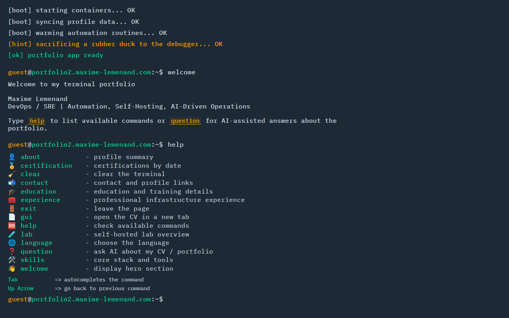

# 💻 Terminal Portfolio

> 🌐 [English](README.md) · **Français** · [Español](README.es.md)

Un portfolio interactif en style terminal avec Q&R alimentée par IA, support multilingue, et déploiement Docker-first.

## 📸 Captures d'écran

<table>
  <tr>
    <td align="center"><b>Séquence de démarrage</b></td>
    <td align="center"><b>Aide</b></td>
    <td align="center"><b>Q&R par IA</b></td>
  </tr>
  <tr>
    <td></td>
    <td></td>
    <td></td>
  </tr>
</table>

## ✨ Fonctionnalités

- 🤖 **Q&R par IA** — la commande `question` répond aux questions en langage naturel sur le CV, proxifiée via OpenRouter directement depuis nginx (pas de serveur backend)
- 🌍 **Multilingue** — interface complète FR / EN / ES avec réponses IA adaptées à la locale et une commande `language` pour changer à la volée
- 🎬 **Séquence de démarrage animée** — lignes de démarrage tapées caractère par caractère avant que le terminal devienne interactif
- 🔗 **Liens cliquables** — les URLs dans les sorties de commandes et les réponses IA sont automatiquement rendues comme des liens stylisés
- 📄 **Accès au CV depuis le terminal** — la commande `gui` ouvre le PDF du CV servi directement depuis le container
- 😄 **Réponses aléatoires aux commandes inconnues** — blagues sysadmin/Linux au lieu d'un simple "commande introuvable"
- 📜 **Défilement automatique intelligent** — défilement basé sur MutationObserver qui suit les nouvelles sorties tout en respectant le défilement manuel vers le haut
- ⚡ **Routage PWA** — le service worker exclut `/health` et `/cv/` du fallback SPA pour que les endpoints statiques fonctionnent derrière un reverse proxy
- 🐳 **Déploiement Docker-first** — runtime nginx:alpine avec proxy OpenRouter, endpoint de santé généré au démarrage du container, et un workflow `deploy.sh` tout-en-un

## 🛠 Stack

| Couche | Technologie |
|--------|-------------|
| Frontend | React 18, TypeScript, Vite, styled-components |
| Runtime | nginx:alpine (routage SPA + proxy OpenRouter) |
| Déploiement | Docker + Docker Compose |

## 📁 Structure

```
├── src/              # Source React/Vite
│   ├── src/
│   │   ├── components/
│   │   ├── data/profile.ts   ← tout le contenu personnel est ici
│   │   └── i18n.ts           ← chaînes UI (fr/en/es)
│   └── public/
│       ├── cv/               ← déposez votre PDF ici
│       └── brands/           ← icônes de marques/certifications
├── runtime/          # Contexte de build Docker
│   ├── Dockerfile
│   ├── nginx.conf.template   ← routage SPA + proxy OpenRouter
│   ├── health.sh             ← génère l'endpoint /health au démarrage
│   └── dist/                 ← peuplé par deploy.sh (gitignored)
├── docker-compose.yml
├── deploy.sh         ← build + déploiement en une commande
└── .env.example
```

## 🚀 Installation

```bash
# 1. Cloner
git clone <repo-url>
cd terminal-portfolio

# 2. Configurer l'environnement
cp .env.example .env
# éditer .env — définir OPENROUTER_API_KEY et PORT

# 3. Déployer
./deploy.sh
```

Le portfolio est disponible sur `http://localhost:3012` (ou le PORT configuré).

## 🔑 Variables d'environnement

| Variable             | Description                                   | Requis |
|----------------------|-----------------------------------------------|--------|
| `OPENROUTER_API_KEY` | Clé API OpenRouter (le tier gratuit fonctionne) | Oui  |
| `PORT`               | Port hôte (défaut : `3012`)                   | Non    |

Obtenez une clé gratuite sur [openrouter.ai/keys](https://openrouter.ai/keys).

## 🧑‍💻 Développement

```bash
cd src
npm install
npm run dev       # serveur de dev sur http://localhost:5173
npm run build     # build de production → src/dist/
npm run test      # lancer les tests
npm run lint      # lint
```

## 📦 Déploiement manuel (sans deploy.sh)

```bash
# 1. Build
cd src && npm run build && cd ..

# 2. Synchroniser dist
rsync -a --delete src/dist/ runtime/dist/

# 3. Redémarrer le container
docker compose down
docker compose up -d --build
```

## 🌐 Endpoints

| Chemin            | Description              |
|-------------------|--------------------------|
| `/`               | SPA du portfolio terminal |
| `/health`         | JSON de vérification de santé |
| `/cv/resume.pdf`  | PDF du CV                |
| `/api/question`   | Proxy OpenRouter (POST)  |

## ✏️ Personnaliser le contenu

Tout le contenu personnel se trouve dans [`src/src/data/profile.ts`](src/src/data/profile.ts) — c'est le **seul fichier à modifier** pour adapter le portfolio à une nouvelle personne.

Champs clés en haut de `profile.ts` :

| Champ | Description |
|-------|-------------|
| `firstName` | Utilisé dans les questions d'exemple IA (`question quelles sont les compétences de Jean ?`) |
| `name` | Nom complet affiché dans le terminal |
| `email`, `linkedinUrl`, `githubUrl` | Liens de contact |
| `terminalHost` | Domaine affiché dans le prompt du terminal |
| `cvUrl` | URL du PDF du CV servi par le container |

Les chaînes UI (3 langues) sont dans [`src/src/i18n.ts`](src/src/i18n.ts).

Pour remplacer le CV : déposez votre PDF dans `src/public/cv/` sous le nom `resume.pdf` et mettez à jour `cvUrl` dans `profile.ts`.

## 🔄 Reverse proxy (nginx / NPM)

Si vous utilisez un reverse proxy, assurez-vous qu'il transfère les requêtes telles quelles — la configuration nginx dans le container gère directement le routage SPA et les fichiers statiques.

Le service worker (PWA) exclut automatiquement `/health` et `/cv/` du fallback SPA.
