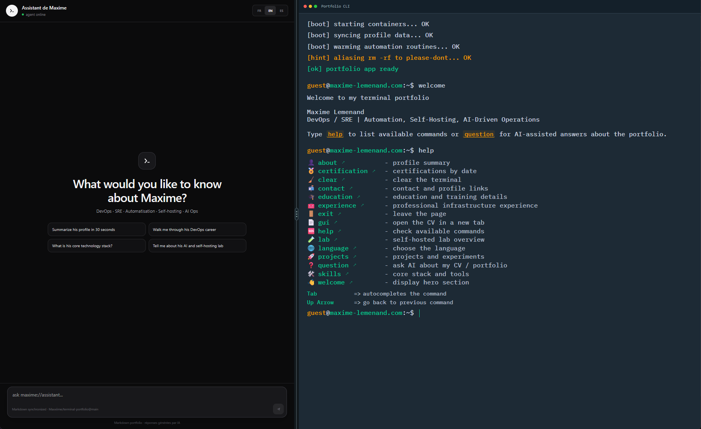
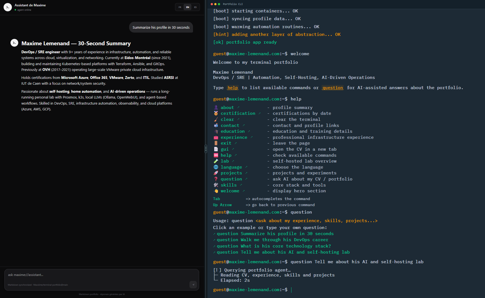
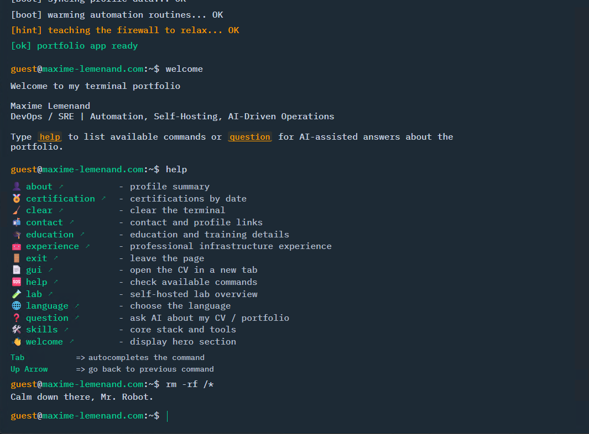

# 💻 Terminal Portfolio

> 🌐 [English](README.md) · **Français** · [Español](README.es.md)

Un portfolio interactif en style terminal avec Q&R alimentée par IA, support multilingue, et déploiement Docker-first.

## 📸 Captures d'écran

<table>
  <tr>
    <td align="center"><b>Séquence de démarrage</b></td>
    <td align="center"><b>Q&R par IA</b></td>
    <td align="center"><b>Commande inconnue</b></td>
  </tr>
  <tr>
    <td></td>
    <td></td>
    <td></td>
  </tr>
</table>

## ✨ Fonctionnalités

- 🤖 **Q&R par IA** — la commande `question` répond aux questions en langage naturel sur le CV, proxifiée via OpenRouter directement depuis nginx (pas de serveur backend)
- 🌍 **Multilingue** — interface complète FR / EN / ES avec réponses IA adaptées à la locale et une commande `language` pour changer à la volée
- 🎬 **Séquence de démarrage animée** — lignes de démarrage tapées caractère par caractère avant que le terminal devienne interactif
- 🔗 **Liens cliquables** — les URLs dans les sorties de commandes et les réponses IA sont automatiquement rendues comme des liens stylisés
- 📄 **Accès au CV depuis le terminal** — la commande `gui` ouvre le PDF du CV servi directement depuis le container
- 😄 **Réponses aléatoires aux commandes inconnues** — blagues sysadmin/Linux au lieu d'un simple "commande introuvable"
- 📜 **Défilement automatique intelligent** — défilement basé sur MutationObserver qui suit les nouvelles sorties tout en respectant le défilement manuel vers le haut
- ⚡ **Routage PWA** — le service worker exclut `/health` et `/cv/` du fallback SPA pour que les endpoints statiques fonctionnent derrière un reverse proxy
- 🐳 **Déploiement Docker-first** — runtime nginx:alpine avec proxy OpenRouter, endpoint de santé généré au démarrage du container, et un workflow `deploy.sh` tout-en-un

## 🛠 Stack

| Couche | Technologie |
|--------|-------------|
| Frontend | React 18, TypeScript, Vite, styled-components |
| Runtime | nginx:alpine (routage SPA + proxy du provider configuré) |
| Déploiement | Docker + Docker Compose |

## 📁 Structure

```
├── src/              # Source React/Vite
│   ├── src/
│   │   ├── components/
│   │   ├── data/profile.ts   ← fallback structuré et métadonnées du CLI
│   │   └── i18n.ts           ← chaînes UI (fr/en/es)
│   └── public/
│       ├── cv/               ← déposez votre PDF ici
│       └── brands/           ← icônes de marques/certifications
├── runtime/          # Contexte de build Docker
│   ├── Dockerfile
│   ├── nginx.conf.template   ← routage SPA + proxy du provider
│   ├── health.sh             ← génère l'endpoint /health au démarrage
│   └── dist/                 ← peuplé par deploy.sh (gitignored)
├── docker-compose.yml
├── deploy.sh         ← build + déploiement en une commande
└── .env.example
```

## 🚀 Installation

```bash
# 1. Cloner
git clone <repo-url>
cd terminal-portfolio

# 2. Configurer l'environnement
cp .env.example .env
# modifier config/portfolio.json et .env

# 3. Déployer
./deploy.sh
```

Le portfolio est disponible sur `http://localhost:3012` (ou le PORT configuré).

Une seule image Docker contient maintenant l'interface split-screen complète : assistant IA à gauche, séparateur redimensionnable et CLI local à droite. Le CLI est servi depuis `/portfolio-cli/` sans dépendre d'un autre domaine.

## 🔧 Configuration

Le fichier unique à modifier pour les réglages non secrets est [`config/portfolio.json`](config/portfolio.json). Il contient le nom, le hostname du terminal, les textes de l'assistant, les métadonnées SEO, les questions, le provider IA, Umami et la source Markdown.

Ce fichier doit rester du **JSON strict** : les commentaires `//` et `/* ... */` ne sont pas autorisés. Gardez les sections `github`, `http` et `local` présentes sans les commenter ; seule celle sélectionnée par `content.mode` est utilisée. Les textes qui changent avec la langue, comme `assistant.title`, acceptent un objet `{ "fr": "...", "en": "...", "es": "..." }`.

Docker monte ce fichier au démarrage :

```yaml
volumes:
  - ./config:/usr/share/nginx/html/config:ro
  - ./content:/usr/share/nginx/html/data/content:ro
  - ./private:/run/portfolio-private:ro
```

Modifiez les fichiers Markdown dans `content/fr/`, `content/en/` et `content/es/` pour mettre à jour les commandes. Tous les Markdown des trois langues sont chargés dès l'ouverture de la page. Les commandes CLI et les deux interfaces de questions IA utilisent le même snapshot.

### Hébergement des fichiers Markdown

La méthode est choisie avec `content.mode` dans `config/portfolio.json`. Seule la section correspondant au mode actif est utilisée ; les autres peuvent rester avec leurs valeurs par défaut.

#### 1. GitHub public

```json
"content": {
  "mode": "github",
  "github": {
    "owner": "Maxxiime",
    "repo": "terminal-portfolio",
    "ref": "main",
    "path": "content"
  }
}
```

Le dépôt doit être public : aucune clé GitHub n'est envoyée au navigateur. Modifiez `content/<langue>/<commande>.md`, committez et poussez sur la branche indiquée par `ref`, puis rechargez la page. Le navigateur vérifie le SHA de cette branche et, s'il a changé, relit directement les 27 fichiers Markdown FR/EN/ES. Le serveur Docker n'a pas besoin de faire `git pull` et `deploy.sh` n'est pas nécessaire.

#### 2. HTTP, HTTPS, S3 ou CDN

```json
"content": {
  "mode": "http",
  "http": {
    "baseUrl": "https://static.example.com/portfolio/content",
    "versionUrl": "https://static.example.com/portfolio/version.json"
  }
}
```

Le stockage doit servir les fichiers publiquement avec CORS autorisé. `versionUrl` est optionnel et peut retourner du texte ou un JSON contenant `sha` ou `version`. Sans URL de version, les Markdown sont relus à chaque ouverture de page.

#### 3. Dossier local monté dans le container

```json
"content": {
  "mode": "local",
  "local": {
    "baseUrl": "/data/content",
    "versionUrl": ""
  }
}
```

Le Compose monte déjà `./content` vers `/usr/share/nginx/html/data/content:ro`. Modifiez par exemple `content/fr/about.md`, puis rechargez la page. Aucun accès GitHub, rebuild, `deploy.sh` ou redémarrage du container n'est nécessaire.

Test rapide depuis le serveur :

```bash
sed -n '1,40p' content/fr/about.md
curl -fsS http://localhost:${PORT:-3012}/data/content/fr/about.md | sed -n '1,40p'
```

Structure attendue pour chaque méthode :

```text
content/
├── fr/{welcome,about,skills,lab,experience,projects,education,certification,ai}.md
├── en/{welcome,about,skills,lab,experience,projects,education,certification,ai}.md
└── es/{welcome,about,skills,lab,experience,projects,education,certification,ai}.md
```

Si un fichier EN ou ES manque, le fichier FR correspondant est utilisé comme fallback. Les Markdown embarqués dans le bundle restent le dernier fallback si la source externe est indisponible.

### Contexte privé réservé à l'IA

Le contexte privé est toujours un fichier local monté côté serveur, quel que soit le `content.mode` utilisé pour les Markdown publics. Ne placez jamais ce fichier dans `content/` ou dans un dépôt GitHub public.

Configuration dans `config/portfolio.json` :

```json
"ai": {
  "providerType": "openai-compatible",
  "providerUrl": "https://openrouter.ai/api/v1/chat/completions",
  "model": "openrouter/free",
  "privateContextFile": "/run/portfolio-private/.IAinformation.md"
}
```

Création :

```bash
cp private/.IAinformation.example.md private/.IAinformation.md
chmod 600 private/.IAinformation.md
nano private/.IAinformation.md
```

Le fichier est ignoré par Git, monté hors de `/usr/share/nginx/html` et lu par le backend à chaque question. Une modification est donc immédiate, sans `deploy.sh` ni redémarrage. Son contenu n'apparaît dans aucune commande CLI et n'est jamais envoyé au navigateur.

Ce mécanisme permet de fournir des faits conditionnels, par exemple une adresse courriel accompagnée de la règle « communiquer uniquement si le visiteur demande comment me contacter ». Ce n'est pas un coffre à secrets : le provider IA reçoit le contenu et le modèle peut divulguer une information dans sa réponse. N'y placez jamais de mot de passe, clé API, token ou credential.

### Variables d'environnement

| Variable | Description | Requis |
|---|---|---|
| `AI_PROVIDER_API_KEY` | Clé du provider, conservée côté backend | Selon le provider |
| `PORT` | Port hôte, défaut `3012` | Non |

Les paramètres `providerType`, `providerUrl` et `model` sont dans `config/portfolio.json`. Exemples OpenRouter, OpenAI et Ollama dans [`.env.example`](.env.example). Ne placez jamais `AI_PROVIDER_API_KEY` dans le frontend.

Obtenez une clé gratuite sur [openrouter.ai/keys](https://openrouter.ai/keys).

## 🧑‍💻 Développement

```bash
cd src
npm install
npm run dev       # serveur de dev sur http://localhost:5173
npm run build     # build de production → src/dist/
npm run test      # lancer les tests
npm run lint      # lint
```

## 📦 Déploiement manuel (sans deploy.sh)

```bash
# 1. Build
cd src && npm run build && cd ..

# 2. Synchroniser dist
rsync -a --delete src/dist/ runtime/dist/

# 3. Redémarrer le container
docker compose down
docker compose up -d --build
```

## 🌐 Endpoints

| Chemin            | Description              |
|-------------------|--------------------------|
| `/`               | Split-screen assistant IA + CLI |
| `/portfolio-cli/` | CLI local embarqué dans la même image |
| `/health`         | JSON de vérification de santé |
| `/cv/resume.pdf`  | PDF du CV                |
| `/api/question`   | Proxy du provider configuré (POST)  |

## ✏️ Personnaliser le portfolio

Utilisez ces fichiers :

| Fichier | Rôle |
|---|---|
| [`config/portfolio.json`](config/portfolio.json) | Nom, assistant, SEO, questions, provider, analytics et source Markdown |
| [`content/fr/`](content/fr/) | Contenu français et connaissances IA |
| [`content/en/`](content/en/) | Contenu anglais et connaissances IA |
| [`content/es/`](content/es/) | Contenu espagnol et connaissances IA |
| [`src/src/data/profile.ts`](src/src/data/profile.ts) | Fallback structuré et métadonnées encore nécessaires au CLI (contacts, CV, icônes et commandes) |
| [`src/src/i18n.ts`](src/src/i18n.ts) | Chaînes UI du terminal |

`profile.ts` est toujours utilisé. Les Markdown sont la source éditoriale des commandes et de l'IA, tandis que ce fichier fournit encore les fallbacks et données structurées nécessaires à plusieurs composants du CLI. Il ne faut donc pas le supprimer tant que ces composants n'ont pas tous été migrés vers les Markdown et `portfolio.json`.

Champs clés en haut de `profile.ts` :

| Champ | Description |
|-------|-------------|
| `firstName` | Utilisé dans les questions d'exemple IA (`question quelles sont les compétences de Jean ?`) |
| `name` | Nom complet affiché dans le terminal |
| `email`, `linkedinUrl`, `githubUrl` | Liens de contact |
| `terminalHost` | Domaine affiché dans le prompt ; configuré dans `portfolio.json` |
| `cvUrl` | URL du PDF du CV servi par le container |

Les chaînes UI (3 langues) sont dans [`src/src/i18n.ts`](src/src/i18n.ts).

Pour remplacer le CV : déposez votre PDF dans `src/public/cv/` sous le nom `resume.pdf` et mettez à jour `cvUrl` dans `profile.ts`.

En mode local, mettez `content.mode` à `local`, utilisez `/data/content` dans `config/portfolio.json` et modifiez les fichiers dans `content/<locale>/`. Le dépôt GitHub doit être public, car aucun token GitHub n'est utilisé.

Pour tester une modification locale, éditez `content/fr/about.md`, rechargez la page et lancez `about`. Aucun rebuild, redémarrage Compose ou `deploy.sh` n'est nécessaire. En mode GitHub, committez le Markdown sur la branche publique configurée puis rechargez la page ; aucun redéploiement n'est nécessaire. Un rebuild est nécessaire uniquement pour modifier l'application elle-même ou utiliser du contenu embarqué.

## 🔄 Reverse proxy (nginx / NPM)

Si vous utilisez un reverse proxy, assurez-vous qu'il transfère les requêtes telles quelles — la configuration nginx dans le container gère directement le routage SPA et les fichiers statiques.

Le service worker (PWA) exclut automatiquement `/health` et `/cv/` du fallback SPA. Les réglages non secrets ne sont pas dupliqués dans `.env`.
